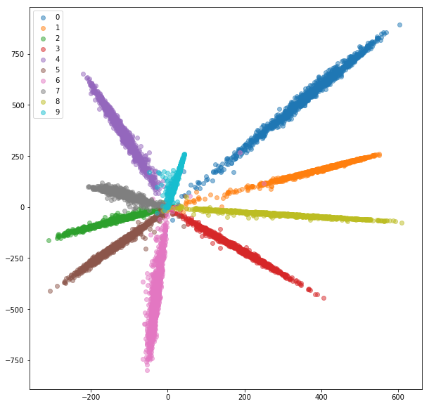
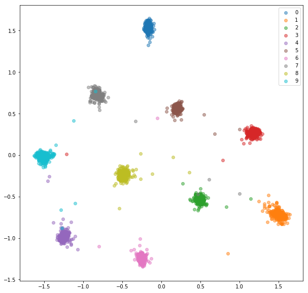
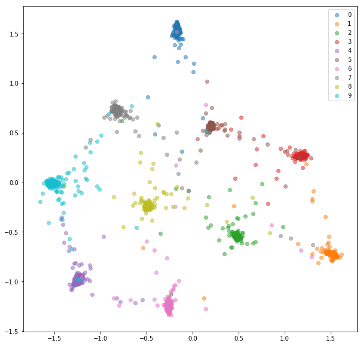
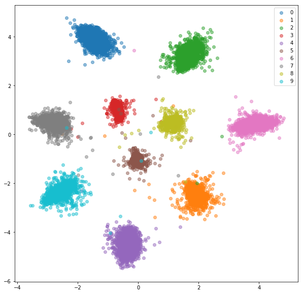
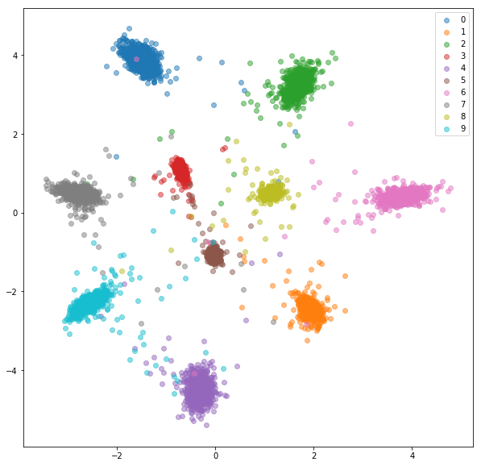
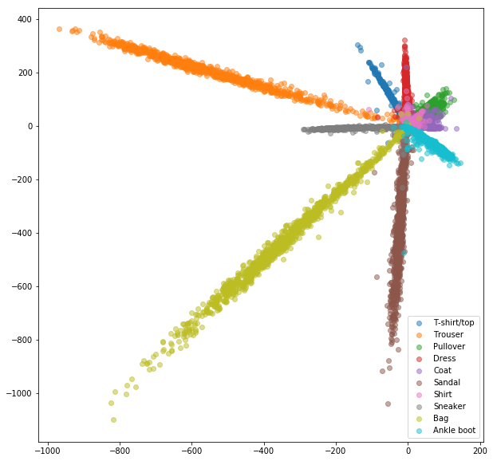
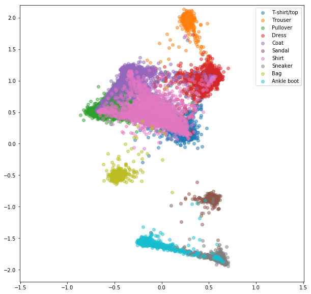
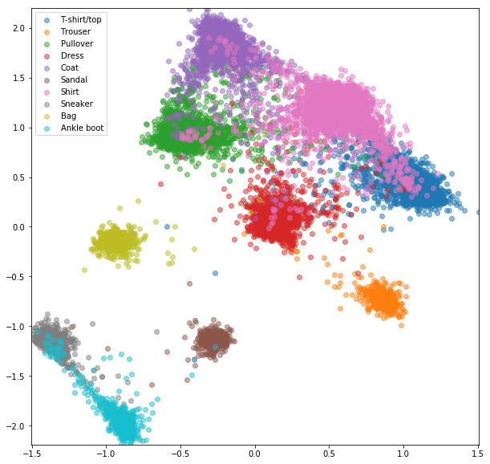
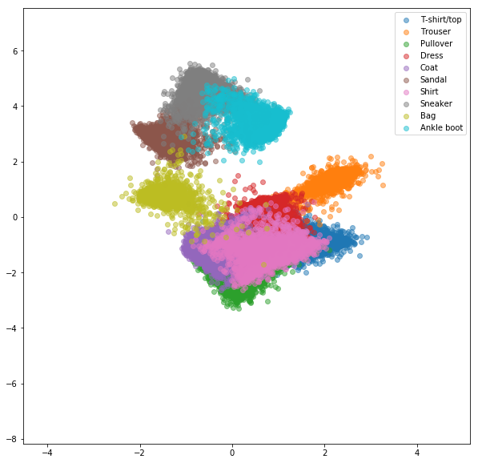
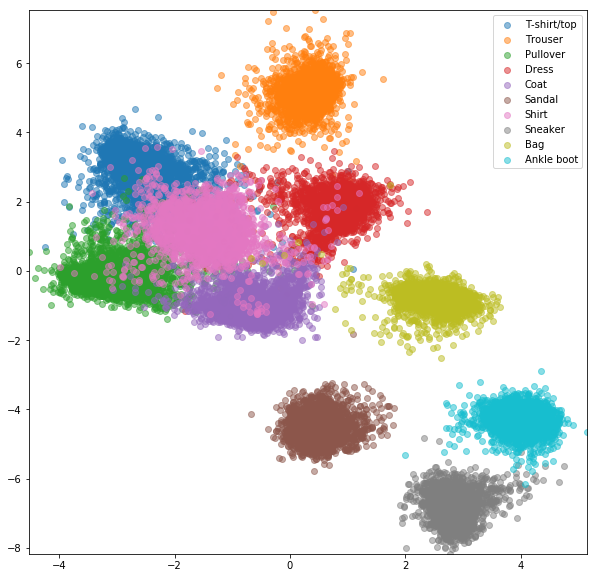

# Siamese and triplet learning with online pair/triplet mining

PyTorch implementation of siamese and triplet networks for learning embeddings.

Siamese and triplet networks are useful to learn mappings from image to a compact Euclidean space where distances correspond to a measure of similarity [2]. Embeddings trained in such way can be used as features vectors for classification or few-shot learning tasks.

# Installation

Requires [pytorch](http://pytorch.org/) 0.4 with torchvision 0.2.1

For pytorch 0.3 compatibility checkout tag torch-0.3.1

# Code structure

- **datasets.py**
  - *SiameseMNIST* class - wrapper for a MNIST-like dataset, returning random positive and negative pairs
  - *TripletMNIST* class - wrapper for a MNIST-like dataset, returning random triplets (anchor, positive and negative)
  - *BalancedBatchSampler* class - BatchSampler for data loader, randomly chooses *n_classes* and *n_samples* from each class based on labels
- **networks.py**
  - *EmbeddingNet* - base network for encoding images into embedding vector
  - *ClassificationNet* - wrapper for an embedding network, adds a fully connected layer and log softmax for classification
  - *SiameseNet* - wrapper for an embedding network, processes pairs of inputs
  - *TripletNet* - wrapper for an embedding network, processes triplets of inputs
- **losses.py**
  - *ContrastiveLoss* - contrastive loss for pairs of embeddings and pair target (same/different)
  - *TripletLoss* - triplet loss for triplets of embeddings
  - *OnlineContrastiveLoss* - contrastive loss for a mini-batch of embeddings. Uses a *PairSelector* object to find positive and negative pairs within a mini-batch using ground truth class labels and computes contrastive loss for these pairs
  - *OnlineTripletLoss* - triplet loss for a mini-batch of embeddings. Uses a *TripletSelector* object to find triplets within a mini-batch using ground truth class labels and computes triplet loss
- **trainer.py**
  - *fit* - unified function for training a network with different number of inputs and different types of loss functions
- **metrics.py**
  - Sample metrics that can be used with *fit* function from *trainer.py*
- **utils.py**
  - *PairSelector* - abstract class defining objects generating pairs based on embeddings and ground truth class labels. Can be used with *OnlineContrastiveLoss*.
    - *AllPositivePairSelector, HardNegativePairSelector* - PairSelector implementations
  - *TripletSelector* - abstract class defining objects generating triplets based on embeddings and ground truth class labels. Can be used with *OnlineTripletLoss*.
    - *AllTripletSelector*, *HardestNegativeTripletSelector*, *RandomNegativeTripletSelector*, *SemihardNegativeTripletSelector* - TripletSelector implementations

# Examples - MNIST

We'll train embeddings on MNIST dataset. Experiments were run in [jupyter notebook](archive/Experiments_MNIST.ipynb).

We'll go through learning supervised feature embeddings using different loss functions on MNIST dataset. This is just for visualization purposes, thus we'll be using 2-dimensional embeddings which isn't the best choice in practice.

For every experiment the same embedding network is used (32 conv 5x5 -> PReLU -> MaxPool 2x2 -> 64 conv 5x5 -> PReLU -> MaxPool 2x2 -> Dense 256 -> PReLU -> Dense 256 -> PReLU -> Dense 2) and we don't perform any hyperparameter search.

## Baseline - classification with softmax

We add a fully-connected layer with the number of classes and train the network for classification with softmax and cross-entropy. The network trains to ~99% accuracy. We extract 2 dimensional embeddings from penultimate layer:

Train set:

Test set:

While the embeddings look separable (which is what we trained them for), they don't have good metric properties. They might not be the best choice as a descriptor for new classes.

## Siamese network

Now we'll train a siamese network that takes a pair of images and trains the embeddings so that the distance between them is minimized if they're from the same class and is greater than some margin value if they represent different classes.
We'll minimize a contrastive loss function [1]:

*SiameseMNIST* class samples random positive and negative pairs that are then fed to Siamese Network.

After 20 epochs of training here are the embeddings we get for training set:

Test set:

The learned embeddings are clustered much better within class.

## Triplet network

We'll train a triplet network, that takes an anchor, a positive (of same class as an anchor) and negative (of different class than an anchor) examples. The objective is to learn embeddings such that the anchor is closer to the positive example than it is to the negative example by some margin value.

Source: *Schroff, Florian, Dmitry Kalenichenko, and James Philbin. [Facenet: A unified embedding for face recognition and clustering.](https://arxiv.org/abs/1503.03832) CVPR 2015.*

**Triplet loss**:   

*TripletMNIST* class samples a positive and negative example for every possible anchor.

After 20 epochs of training here are the embeddings we get for training set:

Test set:

The learned embeddings are not as close to each other within class as in case of siamese network, but that's not what we optimized them for. We wanted the embeddings to be closer to other embeddings from the same class than from the other classes and we can see that's where the training is going to.

## Online pair/triplet selection - negative mining

There are couple of problems with siamese and triplet networks:
1. The **number of possible pairs/triplets** grows **quadratically/cubically** with the number of examples. It's infeasible to process them all and the training converges slowly.
2. We generate pairs/triplets *randomly*. As the training continues, more and more pairs/triplets are **easy** to deal with (their loss value is very small or even 0), *preventing the network from training*. We need to provide the network with **hard examples**.
3. Each image that is fed to the network is used only for computation of contrastive/triplet loss for only one pair/triplet. The computation is somewhat wasted; once the embedding is computed, it could be reused for many pairs/triplets.

To deal with these issues efficiently, we'll feed a network with standard mini-batches as we did for classification. The loss function will be responsible for selection of hard pairs and triplets within mini-batch. If we feed the network with 16 images per 10 classes, we can process up to 159\*160/2 = 12720 pairs and 10\*16\*15/2\*(9\*16) = 172800 triplets, compared to 80 pairs and 53 triplets in previous implementation.

Usually it's not the best idea to process all possible pairs or triplets within a mini-batch. We can find some strategies on how to select triplets in [2] and [3].

### Online pair selection

We'll feed a network with mini-batches, as we did for classification network. This time we'll use a special BatchSampler that will sample *n_classes* and *n_samples* within each class, resulting in mini batches of size *n_classes\*n_samples*.

For each mini batch positive and negative pairs will be selected using provided labels.

MNIST is a rather easy dataset and the embeddings from the randomly selected pairs were quite good already, we don't see much improvement here.

**Train embeddings:**

**Test embeddings:**

### Online triplet selection

We'll feed a network with mini-batches just like with online pair selection. There are couple of strategies we can use for triplet selection given labels and predicted embeddings:

- All possible triplets (might be too many)
- Hardest negative for each positive pair (will result in the same negative for each anchor)
- Random hard negative for each positive pair (consider only triplets with positive triplet loss value)
- Semi-hard negative for each positive pair (similar to [2])

The strategy for triplet selection must be chosen carefully. A bad strategy might lead to inefficient training or, even worse, to model collapsing (all embeddings ending up having the same values).

Here's what we got with random hard negatives for each positive pair.

**Training set:**

**Test set:**

# FashionMNIST

Similar experiments were conducted for [FashionMNIST](https://github.com/zalandoresearch/fashion-mnist) dataset where advantages of online negative mining are slightly more visible. The exact same network architecture with only 2-dimensional embeddings was used, which is probably not complex enough for learning good embeddings.
More complex datasets with higher number classses should benefit even more from online mining.

## Baseline - classification

## Siamese vs online contrastive loss with negative mining

Siamese network with randomly selected pairs

Online contrastive loss with negative mining

## Triplet vs online triplet loss with negative mining

Triplet network with random triplets

Online triplet loss with negative mining

# TODO

- [ ] Optimize triplet selection
- [ ] Evaluate with a metric that is comparable between approaches
- [ ] Evaluate in one-shot setting when classes from test set are not in train set
- [ ] Show online triplet selection example on more difficult datasets

# References

[1] Raia Hadsell, Sumit Chopra, Yann LeCun, [Dimensionality reduction by learning an invariant mapping](http://yann.lecun.com/exdb/publis/pdf/hadsell-chopra-lecun-06.pdf), CVPR 2006

[2] Schroff, Florian, Dmitry Kalenichenko, and James Philbin. [Facenet: A unified embedding for face recognition and clustering.](https://arxiv.org/abs/1503.03832) CVPR 2015

[3] Alexander Hermans, Lucas Beyer, Bastian Leibe, [In Defense of the Triplet Loss for Person Re-Identification](https://arxiv.org/pdf/1703.07737), 2017

[4] Brandon Amos, Bartosz Ludwiczuk, Mahadev Satyanarayanan, [OpenFace: A general-purpose face recognition library with mobile applications](http://reports-archive.adm.cs.cmu.edu/anon/2016/CMU-CS-16-118.pdf), 2016

[5] Yi Sun, Xiaogang Wang, Xiaoou Tang, [Deep Learning Face Representation by Joint Identification-Verification](http://papers.nips.cc/paper/5416-deep-learning-face-representation-by-joint-identification-verification), NIPS 2014
